### Understanding the ggplot Syntax

 - ggplot works with dataframes not individual vectors

```r
# turn off scientific notation
options(scipen=999)
# import ggplot module
library(ggplot2)
# load data(data_name, package = package_name)
data("midwest", package = "ggplot2")
ggplot(midwest, aes(x=area, y=poptotal))
```

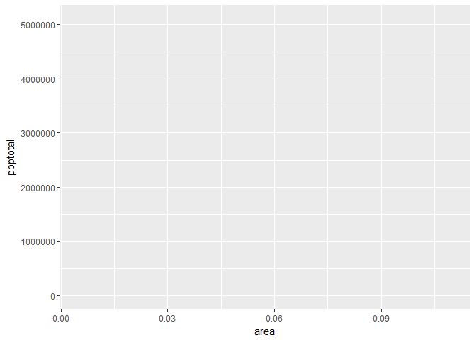<!-- -->

```r
# aes() is used to specify axes
```
- notice this only creates a blank plot

### How to Make a Simple Scatterplot

- to add points to the scatterplot, we use a geom layer called geom_point()

```r
gg <- ggplot(midwest, aes(x=area, y=poptotal)) + geom_point()
gg
```

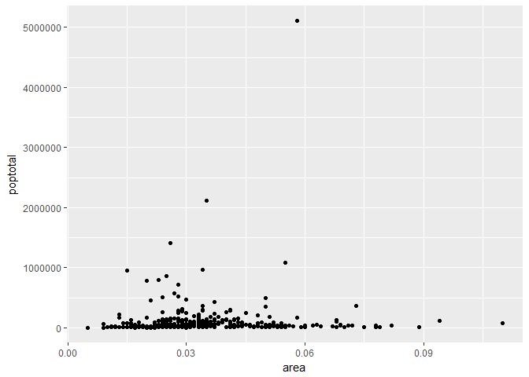<!-- -->

- to add a smoothing layer, use geom_smooth(method='lm'), lm means linear model, this draws a line of best fit

```r
gg1 <- ggplot(midwest, aes(x=area, y=poptotal)) + geom_point() + geom_smooth(method="lm")
#se=FALSE turns off confidence bands
gg1
```

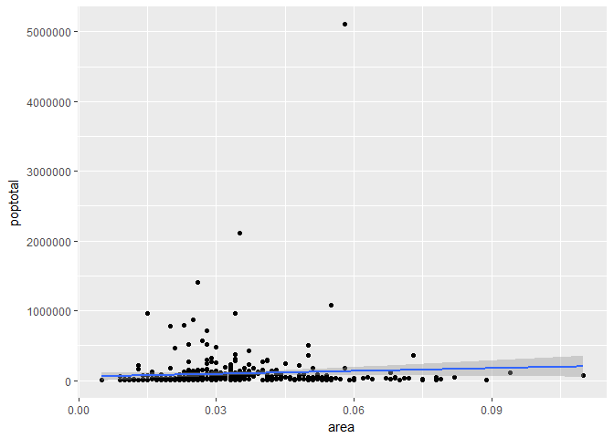<!-- -->

### Adjusting the X and Y Axis Limits

- there are 2 ways to control axes limits

##### Method 1: By deleting points outside the range

- this can be done by xlim() and ylim()


```r
gg2 <- gg1 + xlim(c(0, 0.1)) + ylim(c(0, 1000000))
gg2
```

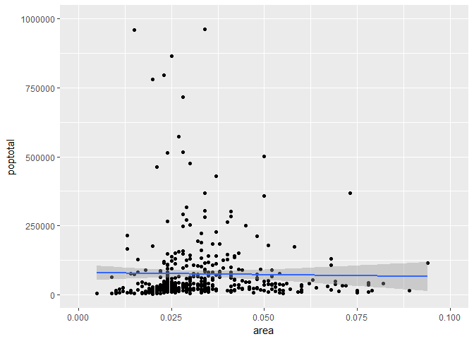<!-- -->

##### Method 2: Zooming in

- this zooms into the region of interest without deleting points, done using coord_cartesian()

```r
gg3 <- gg1 + coord_cartesian(xlim=c(0, 0.1), ylim=c(0, 1000000))
gg3
```

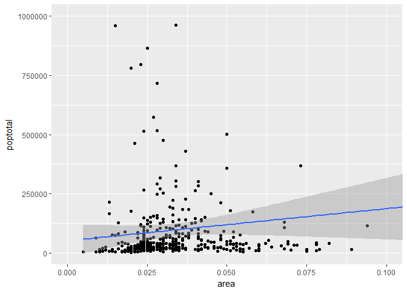<!-- -->

### Changing Title and Axis Labels

- this can be done using the labs() function

```r
gg4 <- gg3 + labs(title="Area Vs Population", subtitle="From midwest dataset", y="Population", x="Area", caption="Midwest Demographics")
gg4
```

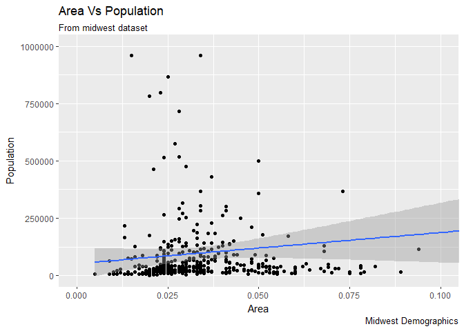<!-- -->

### Changing Color and Size of Points


```r
gg5 <- ggplot(midwest, aes(x=area, y=poptotal)) + geom_point(col="steelblue", size=3) + geom_smooth(method="lm", col="firebrick") + coord_cartesian(xlim=c(0, 0.1), ylim=c(0, 1000000)) + labs(title="Area Vs Population", subtitle="From midwest dataset", y="Population", x="Area", caption="Midwest Demographics")
gg5
```

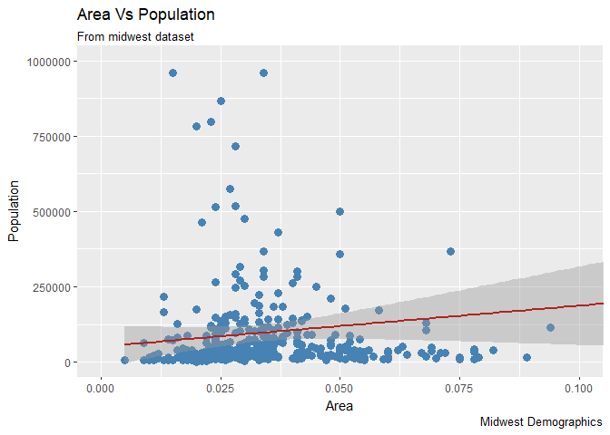<!-- -->

##### Changing Color to Reflect Categories in Another Column

- use geom_point(aes(col=column_name))

```r
gg6 <- ggplot(midwest, aes(x=area, y=poptotal)) + geom_point(aes(col=state), size=3) + geom_smooth(method="lm", col="firebrick") + coord_cartesian(xlim=c(0, 0.1), ylim=c(0, 1000000)) + labs(title="Area Vs Population", subtitle="From midwest dataset", y="Population", x="Area", caption="Midwest Demographics")
gg6
```

<!-- -->

- you can also categorize based on size, shape, stroke, and fill, not just color!
- you can change color palettes by:


```r
gg6 + scale_colour_brewer(palette = "Set5")
```

```
## Warning in pal_name(palette, type): Unknown palette Set5
```

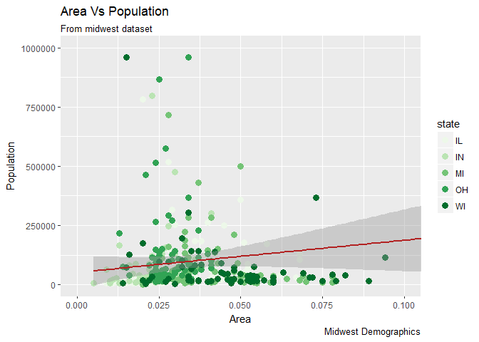<!-- -->

### How to Change X Axis Texts and Ticks Location

- this involves 2 aspects, breaks and labels

- breaks should be of the same scale as the X axis variable (ie. if variable is continuous use scale_x_continuous, if variable is date use scale_x_date)

```r
gg7 <- gg6 + scale_x_continuous(breaks=seq(0, 0.1, 0.01))
# this means from 0 to 0.1 in increments of 0.01
gg7
```

<!-- -->

- if we wanted to change the labels:

```r
gg6 + scale_x_continuous(breaks=seq(0, 0.1, 0.01), labels = letters[1:11])
```

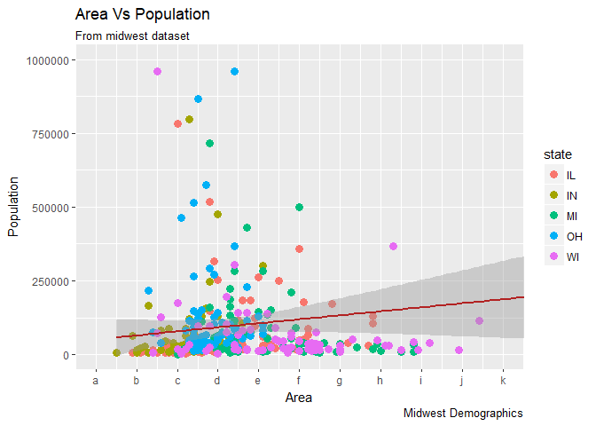<!-- -->

```r
# this set the labels to letters of the alphabet instead of the numbers
```

- to reverse scale, use scale_x_reverse()

##### How to Customize Entire Theme?

- there are pre-built themes
- call ?theme_bw to view available ones

```r
gg7 + theme_void() + labs(subtitle="Void Theme")
```

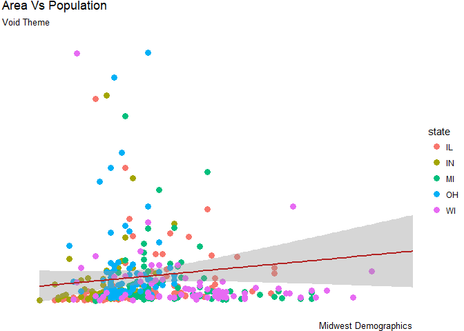<!-- -->

```r
gg7 + theme_minimal() + labs(subtitle="Minimal Theme")
```

<!-- -->

### Summary

- to plot all in one go

```r
library(ggplot2)
data("midwest", package = "ggplot2")
ggplot(midwest, aes(x=area, y=poptotal)) + geom_point(aes(col=state), size=1) + geom_smooth(method="lm", col="steelblue", size=2) + coord_cartesian(xlim=c(0, 0.1), ylim=c(0, 1000000)) + labs(title="Area Vs Population", subtitle="From midwest dataset", y="Population", x="Area", caption="Midwest Demographics") + scale_x_continuous(breaks=seq(0, 0.1, 0.01)) + theme_dark()
```

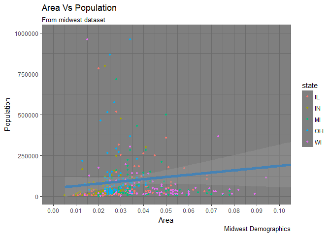<!-- -->

1. library(ggplot2)
2. data("data_name"", package = "package_name"")
3. ggplot(data_name, aes(x=x_name, y=y_name))
4. geom_point()
5. geom_smooth()
6. coord_cartesian()/ xlim() & ylim()
7. labs()


