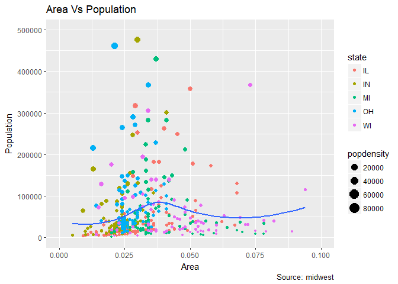
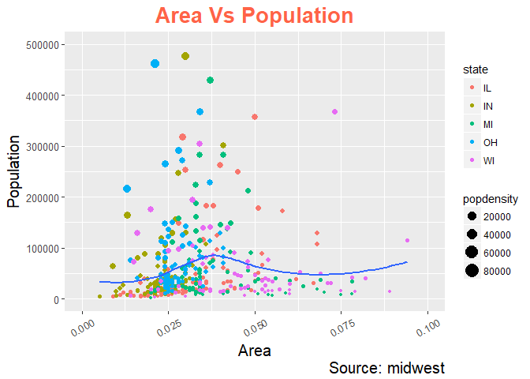
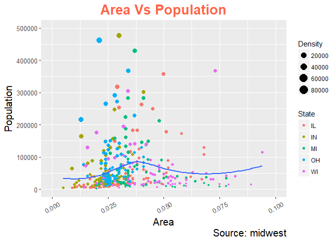
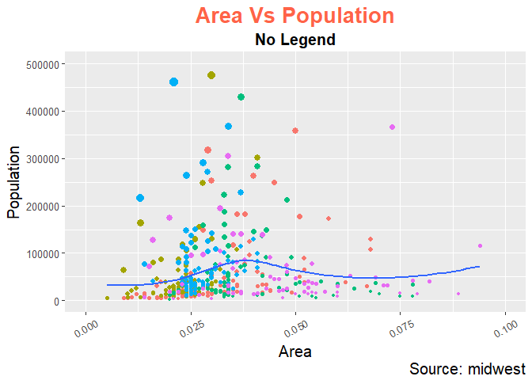
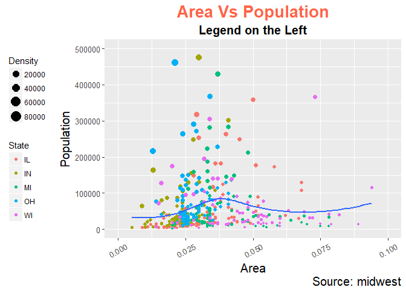
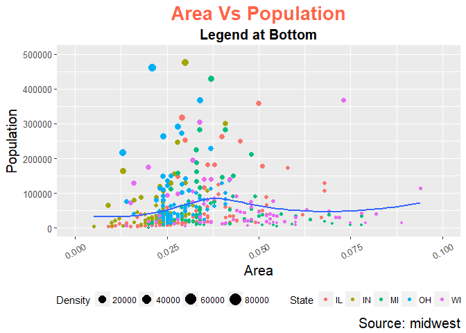
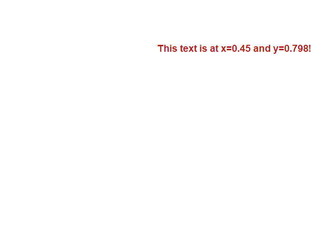
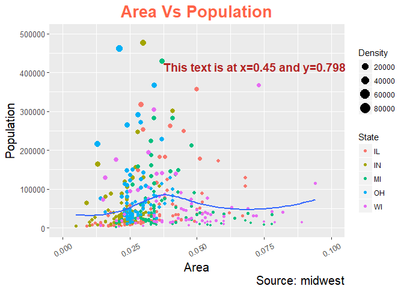
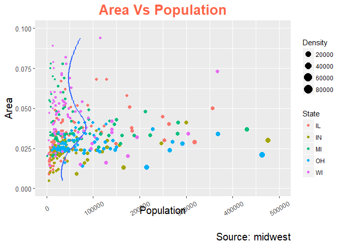
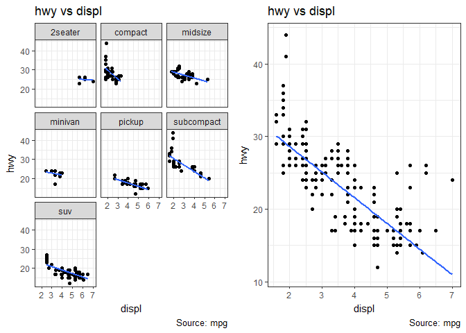

- geom_point(aes(col=state, size=popdensity))
- under geom_point(aes()) you can set color of the points to one variable and size to another

```r
options(scipen=999)
library(ggplot2)
data("midwest", package = "ggplot2")
theme_set(theme_grey())
gg1 <- ggplot(midwest, aes(x=area, y=poptotal)) + geom_point(aes(col=state, size=popdensity)) + geom_smooth(method="loess", se=F) + xlim(c(0, 0.1)) + ylim(c(0,500000)) + labs(title="Area Vs Population", y="Population", x="Area", caption="Source: midwest")

gg1
```

<!-- -->

### Adding Plot and Axis Titles

- plot and axis titles are part of the plot's theme, so we can modify it with the theme() function
- the function accepts one of the 4 element_type() functions: 
1. element_text(): titles, subtitles, captions
2. element_line(): axis lines, grid lines
3. element_rect(): rectangle components
4. element_blank(): turns off theme


```r
gg2 <- gg1 + theme(plot.title=element_text(size=20, face="bold", color="tomato", hjust=0.5, lineheight=1.2),
           plot.subtitle=element_text(size=15, face="bold", hjust=0.5),
           plot.caption=element_text(size=15),
           axis.title.x=element_text(vjust=10, size= 15),
           axis.title.y=element_text(size=15),
           axis.text.x=element_text(size=10, angle=30, vjust=0.5),
           axis.text.y=element_text(size=10))

gg2
```

<!-- -->

- vjust controls vertical spacing between label and the plot
- hjust controls horizontal spacing (0.5 centers the title!!)
- family sets font
- face ("plain", "italic", "bold", "bold.italic")

### Modifying Legend

- to change legend titles, use labs(legend_name = "new_title")

```r
gg3 <- gg2 + labs(color="State", size="Density")

gg3
```

<!-- -->

- to change order of legend, use guides(legend_name = guide_legend(order= 1), legend_name = guide_legend(order=2))

```r
gg4 <- gg3 + guides(color = guide_legend(order=1), size = guide_legend(order=2))

gg4
```

<!-- -->

- to style legend text, use element_text() in theme(), to style legend key, use element_rect()

##### Changing Legend Positions

```r
gg3 + theme(legend.position="None") + labs(subtitle="No Legend")
```

<!-- -->

```r
gg3 + theme(legend.position="left") + labs(subtitle="Legend on the Left")
```

<!-- -->

```r
gg3 + theme(legend.position="bottom", legend.box = "horizontal") + labs(subtitle="Legend at Bottom")
```

<!-- -->

### Adding Text, Label, and Annotation

- annotations can be added with annotation_custom() which takes a grob as the argument

```r
library(grid)
my_text <- "This text is at x=0.45 and y=0.798!"
my_grob = grid.text(my_text, x=0.7, y=0.8, gp=gpar(col="firebrick", fontsize=14, fontface="bold"))
```

<!-- -->

```r
gg3 + annotation_custom(my_grob)
```

<!-- -->

### Flipping and Reversing X and Y Axis

- just add coord_flip()

```r
gg3 + coord_flip()
```

<!-- -->

##### Reversing Axis Scales?

- use scale_x_reverse() and scale_y_reverse()

### Faceting: Draw multiple plots within one figure


```r
data(mpg, package="ggplot2")
gg4 <- ggplot(mpg, aes(x=displ, y=hwy)) + geom_point() + labs(title="hwy vs displ", caption = "Source: mpg") +
      geom_smooth(method="lm", se=FALSE) + 
      theme_bw()

gg4
```

<!-- -->

- face_wrap() is used to break down a large plot into several smaller ones
- by default all graphs share the same x and y scales but you can set them free by scales="free"


```r
gg5 <- gg4 + facet_wrap( ~ class, nrow=3)
# ~ class means class in the columns. something before the ~ would mean rows
gg5
```

<!-- -->

- to layout multiple charts in the same panel use gridExtra()

```r
library(gridExtra)
gridExtra::grid.arrange(gg5, gg4, ncol=2)
```

<!-- -->


